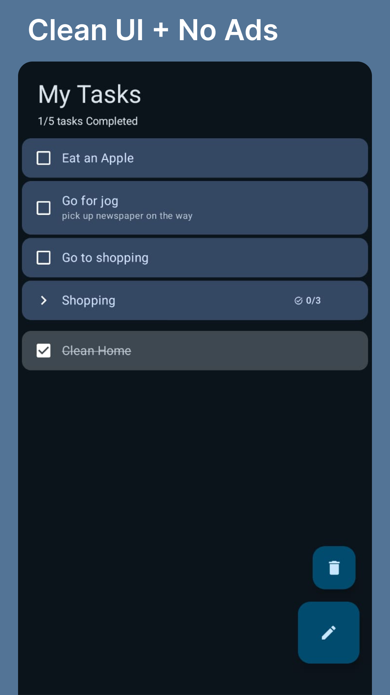
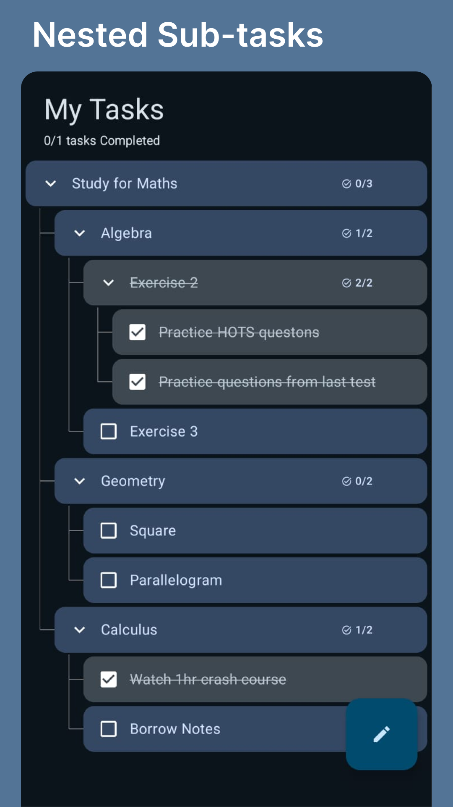
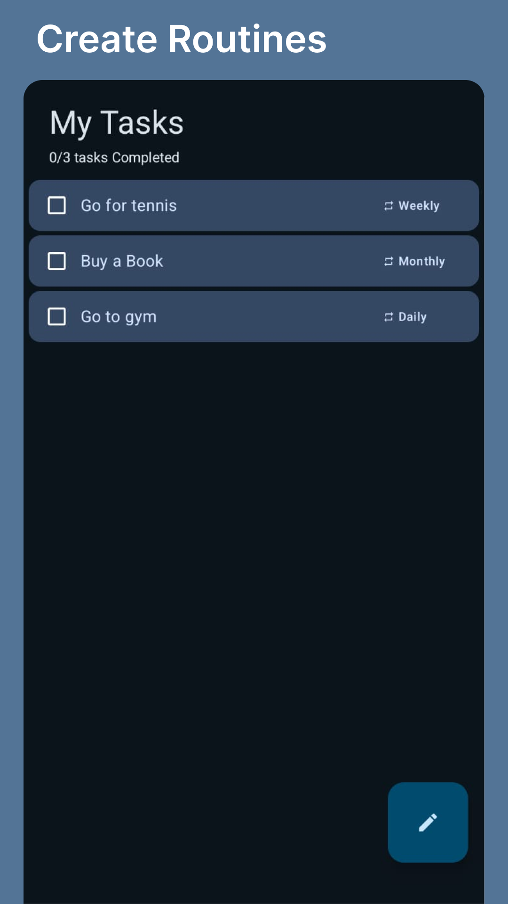
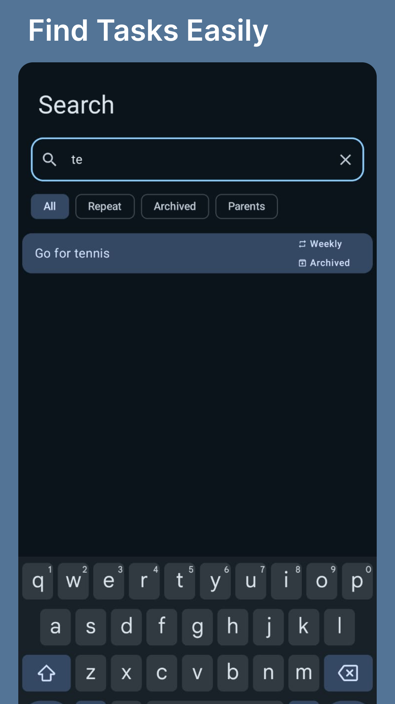
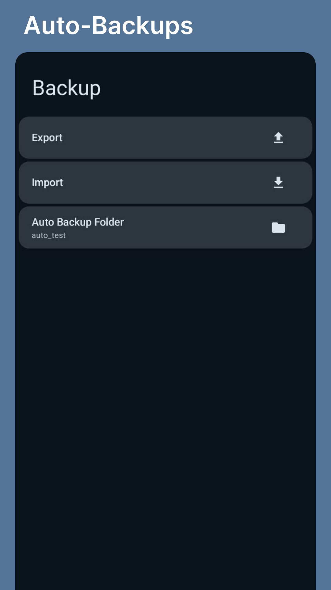
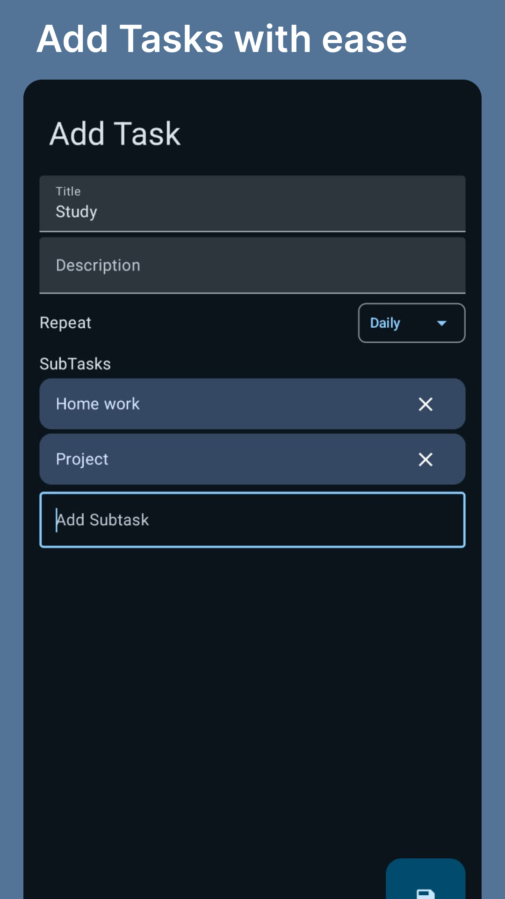

  

# Tidy

A task management app with all necessary features.

## Features

- **Repeating Tasks** — Create tasks that repeat daily, weekly, or monthly.
- **Nested Subtasks** — Organize work with deeply nested subtasks, no depth limit.
- **Search** — Quickly find any task with built-in search.
- **Backup** — Automatic and manual backups; export your data as a JSON file.

## Screenshots

|  |  |
|:---:|:---:|
|  |  |
|  |  |

## License

This project is licensed under the [GNU General Public License v3.0](LICENSE).  
You are free to use, modify, and distribute this software under the same terms.

## Inspiration

Inspired by [Grit](https://github.com/shub39/Grit) and [Tasks](https://github.com/tasks/tasks).

## Author

Gaurav Kumar
